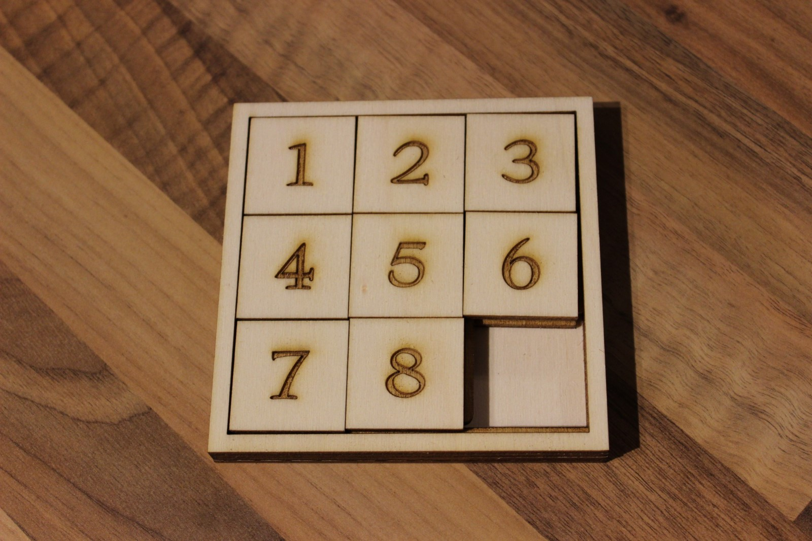

## 1. Overview

In this notebook, we present the A* search algorithm, provide an extensive explanation about how it works and provide a code to solve a sliding puzzle. All further mathematical/theoretical explanations are based on chapter 24 of [Cormen et al. (2009)](https://mitpress.mit.edu/books/introduction-algorithms-third-edition).

In this notebook, we solve a so-called sliding puzzle that consists of several parts in a frame with one empty space, such that only one piece can be moved at a time. The elements are normally in the wrong order, and the goal is to put them in the right order. In such riddles, sometimes the goal is to reveal an image by moving their parts in the right positions, which is a game that some might know from their childhood.

With the help of the A* algorithm, we will try to find the most efficient way to solve such a puzzle and to reach the goal. An example is provided in the images below (with the starting position on the left and the goal position on the right).

The A* search algorithm can be considered as a informed variation of the Dijkstra's algorithm, as it uses information about path cost and also uses heuristics to find the solution. The latter is one of the main advantages that A* provides compared to Dijkstra's as the use of heuristics is meant to speed up the search. It is also one of the most successful search algorithms to find the shortest path between nodes or graphs. The A* search algorithm was first described in 1968 by Peter Hart, Nilds J. Nilsson and Bertram Raphael.

In comparison to other search algorithms, it uses a heuristic function to search for the solution which allows a faster determination. Thereby, the algorithm is complete and optimal - meaning that if an optimal solution exists, it is always found. However, it is important to note that A* is complete and optimal only if an admissible heuristic function is used.

## 2. Implementation and explanation
Information of the solution and how its motivated and implemented are porided in greater detail in the actual notebook. The code was initially not meant to be shared publicly and hence was not implemented following any coding standards.
